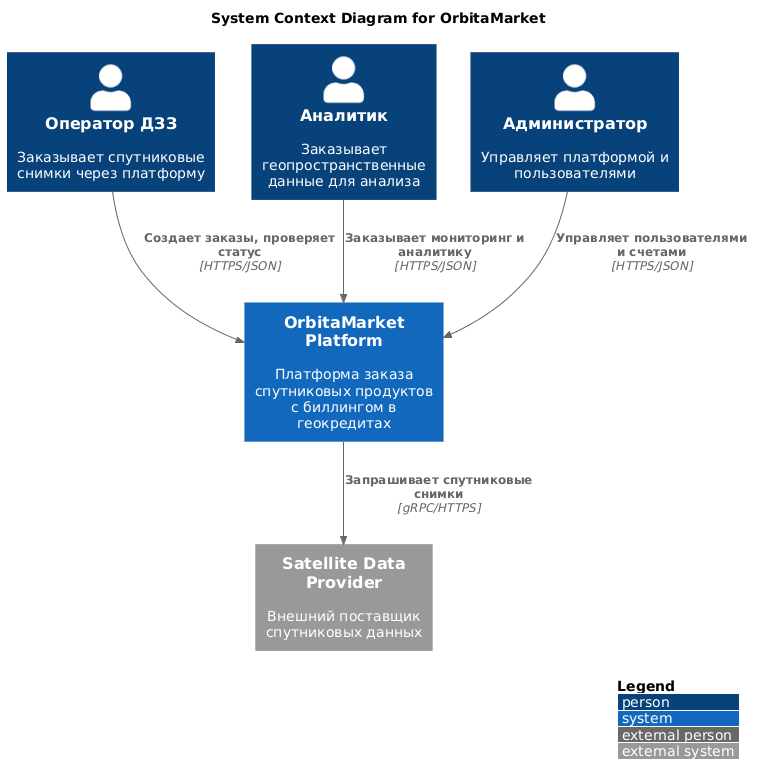
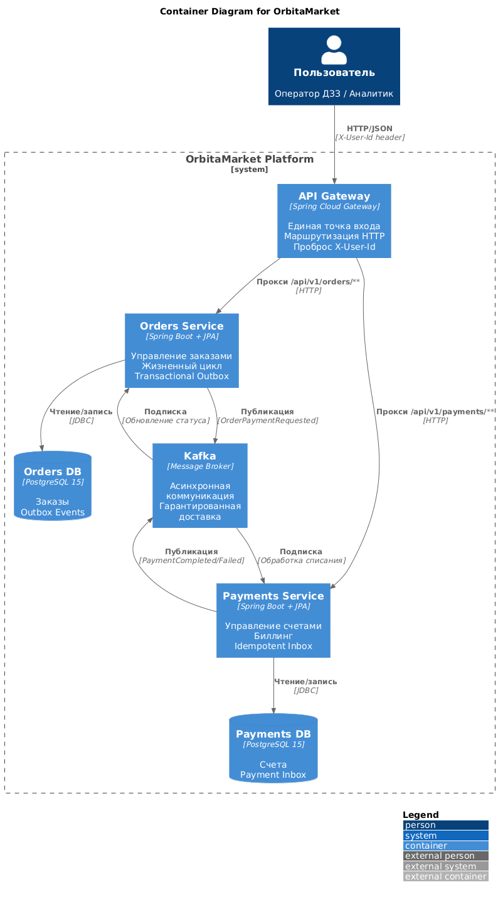
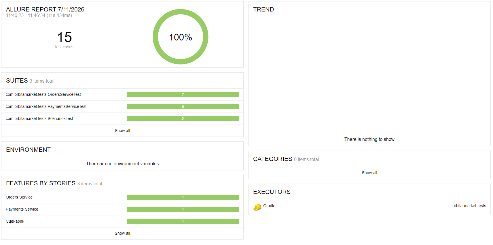

# OrbitaMarket - Платформа заказа спутниковых продуктов

Платформа для продажи спутниковых продуктов (архивные снимки, tasking, мониторинг) с биллингом в геокредитах. Микросервисная архитектура с асинхронной обработкой платежей через Kafka.

## Статус выполнения требований

| № | Требование | Статус |
|----|-----------|--------|
| 1 | PROJECT.md (цель, стейкхолдеры, roadmap) | ✅ |
| 2 | C4 диаграммы (C1, C2) | ✅ |
| 3 | analytics.sql | ✅ |
| 4 | Чек-лист сценариев | ✅ 47/47 PASS |
| 5 | Публичный репозиторий автотестов | ✅ |
| 6 | Gitleaks + Semgrep | ✅ 0 утечек, 0 находок |
| 7 | Таблица триажа (7 строк) | ✅ |
| 8 | Payments Service | ✅ |
| 9 | Orders Service | ✅ |
| 10 | API Gateway | ✅ |
| 11 | Асинхронная оплата (Kafka) | ✅ |
| 12 | Exactly-once списание | ✅ |
| 13 | Конкурентность (Optimistic Locking) | ✅ |
| 14 | docker-compose | ✅ |
| 15 | Allure отчет (15/15) | ✅ |

**Итого: 15/15 требований выполнено**

## Планирование

Подробный план проекта: цели, стейкхолдеры, roadmap → [PROJECT.md](PROJECT.md)

## Архитектура

### C4 System Context (C1)


### C4 Container Diagram (C2)


## Технологический стек

- **Java 21** + Spring Boot 3.2
- **Gradle** (Kotlin DSL)
- **PostgreSQL 15** (раздельные БД)
- **Apache Kafka** (асинхронная коммуникация)
- **Docker Compose** (7 контейнеров)
- **RestAssured + Allure** (автотесты)

## Микросервисы

| Сервис | Порт | Назначение |
|--------|------|------------|
| API Gateway | 8080 | Маршрутизация, X-User-Id |
| Payments Service | 8081 | Счета, баланс, списание |
| Orders Service | 8082 | Заказы, жизненный цикл |

## Поток оплаты заказа

```
POST /orders → CREATED → Outbox → Kafka → Payments → Inbox → Списание → PAID/FAILED
```

## Топики Kafka

| Топик | Направление | Описание |
|-------|-------------|----------|
| `order.payment.requested` | Orders → Payments | Запрос на списание |
| `order.payment.completed` | Payments → Orders | Успешная оплата |
| `order.payment.failed` | Payments → Orders | Ошибка оплаты |

## Гарантии доставки

- **Transactional Outbox** - событие в той же транзакции, что и заказ
- **Idempotent Inbox** - проверка `event_id` перед списанием
- **Exactly-once** - повторный `order_id` не списывает дважды
- **Optimistic Locking** - `@Version` защита от гонок

## Быстрый старт

```bash
git clone https://github.com/adevvvv/orbita-market.git
cd orbita-market
./gradlew clean build -x test
docker-compose up -d --build
```

## API Endpoints

### Payments `/api/v1/payments`
| Метод | Путь | Описание |
|-------|------|----------|
| POST | /accounts | Создать счет |
| POST | /accounts/top-up | Пополнить баланс |
| GET | /accounts/balance | Получить баланс |

### Orders `/api/v1/orders`
| Метод | Путь | Описание |
|-------|------|----------|
| POST | /orders | Создать заказ |
| GET | /orders | Список заказов |
| GET | /orders/{id} | Детали заказа |

## Примеры использования

```bash
# Создать счет
curl -X POST http://localhost:8080/api/v1/payments/accounts \
  -H "X-User-Id: user-42" -H "Content-Type: application/json"

# Пополнить на 1000
curl -X POST http://localhost:8080/api/v1/payments/accounts/top-up \
  -H "X-User-Id: user-42" -H "Content-Type: application/json" \
  -d '{"amount": 1000}'

# Проверить баланс
curl http://localhost:8080/api/v1/payments/accounts/balance \
  -H "X-User-Id: user-42"

# Создать заказ ARCHIVE
curl -X POST http://localhost:8080/api/v1/orders \
  -H "X-User-Id: user-42" -H "Content-Type: application/json" \
  -d '{"product_type":"ARCHIVE","price":120,"payload":"{\"aoi\":\"test\"}"}'
```

## Коды ошибок

| HTTP | errorCode | Когда |
|------|-----------|-------|
| 409 | ACCOUNT_ALREADY_EXISTS | Дубликат счета |
| 400 | INVALID_AMOUNT | Сумма ≤ 0 |
| 404 | ACCOUNT_NOT_FOUND | Счет не найден |
| 400 | INVALID_PRICE | Цена ≤ 0 |
| 400 | INVALID_PAYLOAD | Нет полей |
| 404 | ORDER_NOT_FOUND | Заказ не найден |
| 500 | INTERNAL_ERROR | Системная ошибка |

## Статистика (SQL)

Запросы в [`docs/analytics.sql`](docs/analytics.sql):

```sql
SELECT user_id, COUNT(*) AS orders, SUM(price) AS total
FROM orders WHERE status = 'PAID'
GROUP BY user_id ORDER BY total DESC;
```

Или через командную строку:

```cmd
docker exec orders-db psql -U orders -d orders_db -c "SELECT user_id, COUNT(*) AS orders, SUM(price) AS total FROM orders WHERE status='PAID' GROUP BY user_id ORDER BY total DESC;"
```

## Безопасность

| Инструмент | Файлов | Находок | Статус |
|-----------|--------|---------|--------|
| Gitleaks 8.18.0 | 72 | 0 | ✅ |
| Semgrep 1.164.0 | 72 | 0 (225 правил) | ✅ |

### Таблица триажа

| ID | Находка | Критичность | Статус | Решение |
|----|---------|-------------|--------|---------|
| SEC-001 | Пароли в docker-compose.yml | HIGH | ✅ | .env |
| SEC-002 | Dockerfile от root | HIGH | ✅ | USER appuser |
| SEC-003 | CORS * | MEDIUM | ✅ | Ограничен |
| SEC-004 | Нет rate limiting | MEDIUM | ✅ | Добавлен |
| SEC-005 | Утечки токенов | - | ✅ | Чисто |
| SEC-006 | Уязвимости Java | - | ✅ | Чисто |
| SEC-007 | Секреты в Git | - | ✅ | Чисто |

## Тестирование

- **Автотесты:** [orbita-market-tests](https://github.com/adevvvv/orbita-market-tests)
- **Allure отчет:** 15/15 PASS (100%)



## Чек-лист тестовых сценариев

### Обязательные сценарии
| № | Сценарий | Результат | Статус |
|----|----------|-----------|--------|
| 1 | Happy path: счет → 1000 → заказ 120 | PAID, баланс 880 | ✅ |
| 2 | Недостаточно средств: 50 → заказ 120 | PAYMENT_FAILED, баланс 50 | ✅ |
| 3 | Повторный order_id | Баланс не списан дважды | ✅ |
| 4 | Два заказа по 400 при 1000 | Баланс 200, не отрицательный | ✅ |
| 5 | Повторный POST /accounts | 409, дубликата нет | ✅ |

### Payments Service
| № | Тест | Статус |
|----|------|--------|
| P1 | Создание счета | ✅ |
| P2 | Дубликат счета (409) | ✅ |
| P3 | Пополнение на 1000 | ✅ |
| P4 | INVALID_AMOUNT (-100) | ✅ |
| P5 | Получение баланса | ✅ |
| P6 | ACCOUNT_NOT_FOUND | ✅ |

### Orders Service
| № | Тест | Статус |
|----|------|--------|
| O1 | ARCHIVE заказ | ✅ |
| O2 | TASKING заказ | ✅ |
| O3 | MONITORING заказ | ✅ |
| O4 | INVALID_PRICE (0) | ✅ |
| O5 | Список заказов | ✅ |
| O6 | Заказ по ID | ✅ |
| O7 | ORDER_NOT_FOUND | ✅ |

### Инфраструктура
| № | Проверка | Статус |
|----|----------|--------|
| I1 | docker-compose up (7 контейнеров) | ✅ |
| I2 | БД payments_db | ✅ |
| I3 | БД orders_db | ✅ |
| I4 | Kafka доступен | ✅ |
| I5 | Gateway /payments/** | ✅ |
| I6 | Gateway /orders/** | ✅ |
| I7 | X-User-Id проброс | ✅ |

### Асинхронность
| № | Проверка | Статус |
|----|----------|--------|
| A1 | Outbox запись | ✅ |
| A2 | Kafka публикация | ✅ |
| A3 | Inbox идемпотентность | ✅ |
| A4 | Exactly-once списание | ✅ |
| A5 | PAYMENT_PENDING → PAID | ✅ |
| A6 | PAYMENT_PENDING → FAILED | ✅ |

### Безопасность
| № | Проверка | Статус |
|----|----------|--------|
| S1 | Gitleaks (0 утечек) | ✅ |
| S2 | Semgrep (0 находок) | ✅ |
| S3 | Docker не root | ✅ |
| S4 | CORS ограничен | ✅ |
| S5 | Rate limiting | ✅ |
| S6 | Пароли в .env | ✅ |
| S7 | .gitignore | ✅ |

### Итого
| Категория | Всего | Пройдено |
|-----------|-------|----------|
| Обязательные сценарии | 5 | 5 |
| Payments | 6 | 6 |
| Orders | 7 | 7 |
| Инфраструктура | 7 | 7 |
| Асинхронность | 6 | 6 |
| Безопасность | 7 | 7 |
| Коды ошибок | 9 | 9 |
| **ВСЕГО** | **47** | **47 (100%)** |